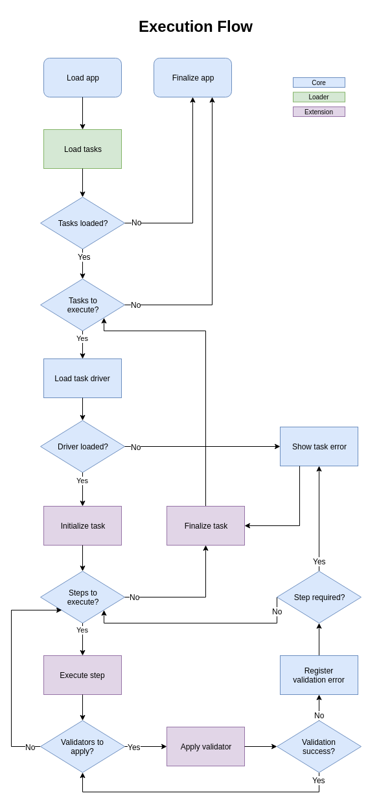

Smedley
=======

A small framework to monitor web applications.

Install
-------

Create a virtualenv with `Python 3.5` with [virtualenvwrapper](https://virtualenvwrapper.readthedocs.org/en/latest/):

    $ mkvirtualenv smedley -p /usr/bin/python3.5

Install dependencies:

    $ make requirements-pip

Configure environment:

	$ make conf-env

Configure
---------

- Core

	- LOG_HANDLERS: List of logger handlers to register output. Default: logconsole;
	- LOG_FILE: Path to write output logs into file;
	- LOGENTRIES_TOKEN: Access token to register logs in [Logentries](https://logentries.com/) service;
	- TASKS_LOADER: Type of loader to retrieve test tasks;
	- TASKS_FILE_PATH: Path to file containing tasks to execute (used with `TASKS_LOADER=file`);
	- TASKS_MASTER_SERVER: URL of server to load tasks (used with `TASKS_LOADER=server`);
	- TASKS_MASTER_SERVER_TIMEOUT: Max time to wait for a response from master server. Default: 3 seconds;

- Extensions

	- Selenium

		- WEB_DRIVER: Browser to use in tests;
		- BROWSER_HEADLESS: If True, will execute browser without interface. If False, will open a browser window to execute tests. Default: True.
		- FIREFOX_EXECUTABLE_PATH: Path to [Geckodriver](https://github.com/mozilla/geckodriver) executable (used with `WEB_DRIVER=firefox`);
		- PHANTOMJS_EXECUTABLE_PATH (Deprecated): Path to [PhantomJs](http://phantomjs.org/) executable (used with `WEB_DRIVER=phantomjs`).

Execute
-------

	$ make run

Test
----

To run tests, just execute:

    $ make test

Docs
----

The following chart show how monitoring tasks are executed and how validation are applied for each step.

To Do
-----

- Project:
	- [ ] Add documentation;
	- [ ] Add integration tests;
	- [ ] Improve log messages;
	- [ ] Identify tasks by id.

- Features:
	- [ ] Capture screenshots on task failures;
	- [x] Add Firefox support inside Docker;
	- [ ] Add Chrome support inside Docker.
